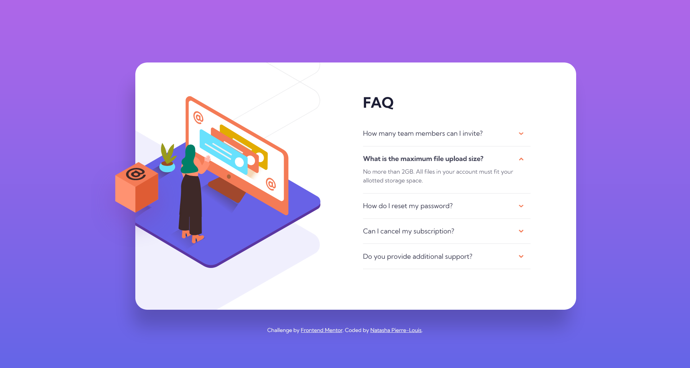

# Frontend Mentor - FAQ Accordion Card built with Pure CSS

This is my solution to the .

## Table of contents

- [Overview](#overview)
  - [Screenshot](#screenshot)
  - [Links](#links)
- [My process](#my-process)
  - [Built with](#built-with)
  - [What I learned](#what-i-learned)
  - [Useful resources](#useful-resources)
- [Author](#author)

## Overview

### Screenshot

### Links

- Solution URL: [https://github.com/natashapl/fem-faq-accordion-card-main](https://github.com/natashapl/fem-faq-accordion-card-main)
- Live Site URL: [https://natashapl.github.io/fem-faq-accordion-card-main/](https://natashapl.github.io/fem-faq-accordion-card-main/)

## My process

### Built with

- Semantic HTML5 markup
- CSS custom properties
- Flexbox

### What I learned

For this project, I decided to try the bonus challenge and build the accordion with pure CSS. Although I've used CSS for years, I felt like a kid in class. It was fun to learn how to create states that would normally be done with javascript using only a checkbox and some CSS styles.

### Useful resources

- [All-CSS Toggle Switch (Checkbox Hack)](https://codepen.io/alvarotrigo/pen/abVPyaJ) - This is a codepen with an example of a toggle switch made of pure CSS. It was this codepen that inspired me to do this challenge.
- [Pure CSS Accordion](https://codepen.io/alvarotrigo/pen/dyJbqpd) - A couple of examples of accordions built with pure CSS. I didn't use their code, but I was also inspired it.
- [20+ Amazing Pure CSS Accordions [Examples 2022]](https://alvarotrigo.com/blog/css-accordion/) - More examples of pure CSS accordions for inspiration.
- [Accordion UX Best Practice](https://www.nikitisza.com/writing/accordion-ux-best-practice) - This is good post about best practices for accordions - when to use them and when not to.

## Author

- Website - [Natasha Pierre-Louis](https://www.natashasfolio.com)
- Frontend Mentor - [@natashapl](https://www.frontendmentor.io/profile/natashapl)
- LinkedIn - [natashapl](https://www.linkedin.com/in/natashapl/)